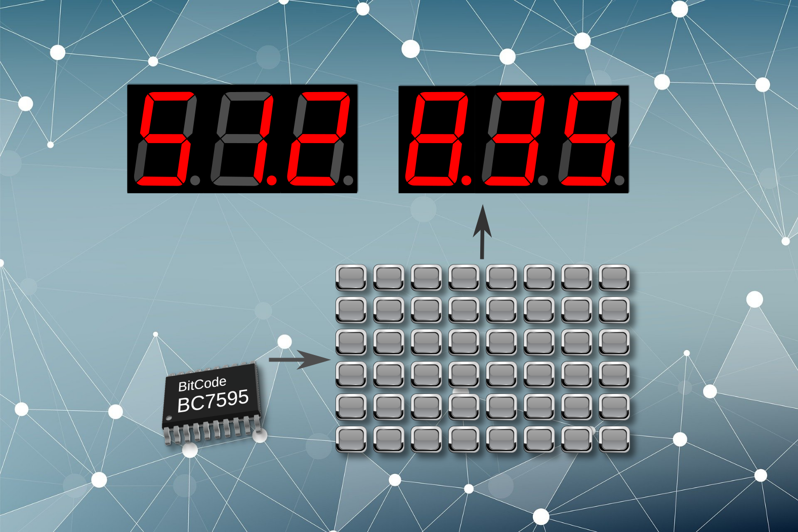
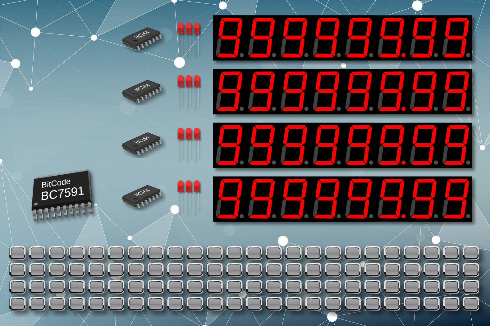

# UART Single-Wire LED Display Driver Library

A lightweight C driver library for BitCode BC759x series LED display driver chips with a UART single-wire display interface.

This library provides a simple API for sending BC759x display commands, clearing the display, showing decimal/hexadecimal/floating-point values, and controlling digit blinking. It supports both polling-style UART transmission and interrupt-driven UART transmission with an internal FIFO buffer.

## Features

- Standard C implementation for embedded MCU projects
- Compatible with C89-style projects when configured properly
- Supports UART single-wire LED display control for BC759x series chips
- Works with either interrupt-driven UART or non-interrupt UART output
- Optional internal UART FIFO buffer in interrupt mode
- High-level helper functions for common display tasks
- Low-level command interface for full BC759x control
- Configurable digit direction for different PCB layouts
- Small code and RAM footprint for resource-limited systems





This library is designed for BC759x series LED display driver + keyboard interface chips that use the unified UART single-wire LED display protocol.

Typical supported devices include BC759x family chips such as [BC7591](docs/bc7591_en.pdf) and [BC7595](docs/bc7595.pdf). For the exact command set and hardware limits of a specific chip, refer to that chip's datasheet.


A utility software is available too to help developers getting things done more quickly. It's available in the release downloads.

The built-in key matrix interface of BC759x shares the same UART and has its own library: [UART Single-Wire Keyboard Driver Library](https://github.com/bitcode-tech/c_uart_keyboard) , the 2 libraries can be used side by side.

## File Structure

```text
led_disp.h       Public API declarations and BC759x command definitions
led_disp.c       Driver implementation
disp_config.h    User configuration file
```

## Installation

Copy the following files into your project:

```text
led_disp.h
led_disp.c
disp_config.h
```

Then:

1. Add `led_disp.c` to your project source file list.
2. Include the header in any source file that uses the display driver:

```c
#include "led_disp.h"
```

Depending on your development environment, you may also need to add the driver directory to the compiler's include search path.

## Configuration

All user-configurable options are located in `disp_config.h`.

### `LOW_DIG_NUM_ON_RIGHT`

Controls the display direction used by `display_dec()`, `display_hex()`, and `display_float()`.

```c
#define LOW_DIG_NUM_ON_RIGHT 1
```

- `1`: Lower-numbered digit positions are on the right side of the display. This is the default layout.
- `0`: Lower-numbered digit positions are on the left side of the display.

Use this option to match different PCB digit arrangements.

### `UART_MODE_INTERRUPT`

Selects the UART transmission mode.

```c
#define UART_MODE_INTERRUPT 1
```

- `1`: Use interrupt-driven UART transmission. The driver uses an internal FIFO buffer.
- `0`: Use non-interrupt UART transmission. The user-supplied UART write function must wait until transmission is complete or until the UART is ready for the next byte.

### `UART_FIFO_SIZE`

Defines the FIFO buffer size used in interrupt mode.

```c
#define UART_FIFO_SIZE 8
```

The value must be a power of two, such as `2`, `4`, `8`, `16`, or `32`.

This setting has no effect when `UART_MODE_INTERRUPT` is set to `0`.

## Basic Concept

Each BC759x command consists of two bytes:

```text
Command byte + Data byte
```

The low-level function `send_cmd()` can send any BC759x command directly:

```c
send_cmd(Cmd, Data);
```

The library also provides higher-level display helper functions for common operations.

## API Reference

The full pdf version of the user manual is here: [UART Single-Wire LED Display Interface Driver Library](docs/UART_Single-Wire_LED_Display_Interface_Driver_Library.pdf)

```c
void set_write_func(void (*pUartWriteFunc)(uint8_t));
```

Registers the UART byte-write function used by the driver.

The user-provided function must take one `uint8_t` argument and return `void`.

This function must be called before using the display driver.

In non-interrupt mode, the UART write function must ensure that the UART is ready before writing, or wait until the byte transmission has completed before returning.

### `set_eni_func()`

```c
void set_eni_func(void (*pTxIntEnFunc)(void));
```

Registers the function used to enable the UART transmit interrupt.

This function is only required when `UART_MODE_INTERRUPT` is set to `1`.

### `set_disi_func()`

```c
void set_disi_func(void (*pTxIntDisFunc)(void));
```

Registers the function used to disable the UART transmit interrupt.

This function is only required when `UART_MODE_INTERRUPT` is set to `1`.

### `tx_ready()`

```c
void tx_ready(void);
```

Notifies the driver that the UART is ready to send the next byte.

This function is normally called from the UART transmit interrupt service routine after the previous byte has been transmitted.

This function is only required when `UART_MODE_INTERRUPT` is set to `1`.

### `send_cmd()`

```c
void send_cmd(uint8_t Cmd, uint8_t Data);
```

Sends one raw BC759x command.

Use this function when you need direct control of chip features that are not wrapped by the higher-level helper functions.

Parameters:

- `Cmd`: Command byte to send
- `Data`: Data byte to send

### `clear()`

```c
void clear(void);
```

Clears all display contents and resets all blinking attributes to the non-blinking state.

### `display_dec()`

```c
void display_dec(uint32_t Val, uint8_t Pos, uint8_t Width);
```

Displays an unsigned integer in decimal format.

Parameters:

- `Val`: Value to display, from `0` to `4,294,967,295`
- `Pos`: Position of the least significant digit
- `Width`: Display width counted from the least significant digit

The lower 7 bits of `Width` define the display width. If the highest bit of `Width` is set, leading zeroes are displayed.

Examples:

```c
display_dec(123, 0, 5);     /* Displays: "  123" */
display_dec(123, 0, 0x85);  /* Displays: "00123" */
```

Only unsigned values are handled directly. To display a negative value, the user must display the minus sign separately.

If the value is wider than the selected display width or exceeds the physical display range, the extra high-order digits are ignored.

### `display_hex()`

```c
void display_hex(uint16_t Val, uint8_t Pos, uint8_t Width);
```

Displays a value in hexadecimal format.

Parameters:

- `Val`: Value to display, from `0x0000` to `0xFFFF`
- `Pos`: Position of the least significant digit
- `Width`: Display width

If `Width` is larger than the number of hexadecimal digits in `Val`, the extra high-order positions are filled with `0`.

Example:

```c
display_hex(0xA5, 0, 5);    /* Displays: "000A5" */
```

Larger values can be displayed by splitting the value and calling this function multiple times.

### `display_float()`

```c
void display_float(float Val, uint8_t Pos, uint8_t Width, uint8_t Frac);
```

Displays a floating-point value as a decimal number, but does not display the decimal point or the sign.

Parameters:

- `Val`: Floating-point value to display
- `Pos`: Position of the least significant digit, normally the lowest digit after the decimal point
- `Width`: Total display width, including integer and fractional digits
- `Frac`: Number of digits after the decimal point

The fractional part is rounded automatically.

The decimal point and minus sign are not generated by this function. If required, they should be controlled separately using chip commands or external hardware.

Examples below show the intended numeric result, including the decimal point for clarity:

```text
Val = 3.14,     Width = 5,    Frac = 4  -> 3.1400
Val = 3.14159,  Width = 7,    Frac = 4  ->   3.1416
Val = 0.00567,  Width = 0x88, Frac = 3  -> 00000.006
```

Internally, this function converts the floating-point value to a 32-bit unsigned integer and then calls `display_dec()`. Avoid settings that may overflow a 32-bit unsigned integer after scaling by the fractional digits.

### `digit_blink()`

```c
void digit_blink(uint8_t Digit, uint8_t OnOff);
```

Controls blinking for one display digit.

Parameters:

- `Digit`: Digit index, from `0` to `31`
- `OnOff`: `0` = blink off, `1` = blink on

Note: If the blinking state for digits 16 to 31 is modified directly through `send_cmd()`, later calls to `digit_blink()` for those digits may overwrite the direct-command settings.

## Non-Interrupt Mode Example

Set `UART_MODE_INTERRUPT` to `0` in `disp_config.h`.

```c
#include "led_disp.h"

uint16_t Counter;

void write_uart(uint8_t TxData)
{
    TX_REG = TxData;        /* Write data to UART transmit register */
    while (!Tx_Ready) {     /* Wait until transmission is complete */
        ;
    }
}

int main(void)
{
    set_write_func(write_uart);

    while (1)
    {
        do_something();

        display_dec(Counter, 0, 5);
        Counter++;

        delay();
    }
}
```

## Interrupt Mode Example

Set `UART_MODE_INTERRUPT` to `1` in `disp_config.h`.

```c
#include "led_disp.h"

uint16_t Counter;

void write_uart(uint8_t TxData)
{
    while (!Tx_Ready) {     /* Wait until the transmit register is empty */
        ;
    }
    TX_REG = TxData;        /* Write data to UART transmit register */
}

void enable_tx_interrupt(void)
{
    TXIE = 1;
}

void disable_tx_interrupt(void)
{
    TXIE = 0;
}

void UART_ISR(void)
{
    if (TX)                 /* UART transmit interrupt */
    {
        tx_ready();
    }
}

int main(void)
{
    set_write_func(write_uart);
    set_eni_func(enable_tx_interrupt);
    set_disi_func(disable_tx_interrupt);

    while (1)
    {
        do_something();

        display_dec(Counter, 0, 5);
        Counter++;

        delay();
    }
}
```

## C89 Compatibility Notes

The driver is written to be suitable for older C standards, including C89-style projects. If your toolchain does not provide `stdint.h`, define the required integer types manually before using the library:

```c
typedef unsigned char  uint8_t;
typedef unsigned short uint16_t;
typedef unsigned long  uint32_t;
```

## License

Add your preferred license here before publishing the repository.

Copyright © Beijing Bitcode Technology Co., Ltd.  
Website: https://bitcode.com.cn/en/
